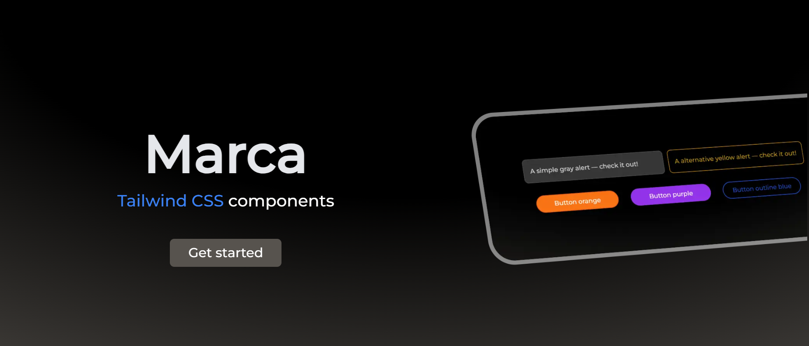

# Marca components





This project aims to leverage the power of Tailwind CSS by integrating a specialized component plugin. This plugin extends Tailwind CSS by providing a curated collection of ready-to-use UI components. By incorporating this plugin into our development workflow, we can streamline UI development, reduce repetitive styling tasks, and accelerate project delivery.

## Installation

#### Package install

- npm
```bash
npm install @alemdev/marca-components
```

#### Plugin Implementation
> Use the plugin in your Tailwind CSS project:

```js
// tailwind.config.mjs
import components from '@alemdev/marca-components'
    export default {
        // ...rest of the options
        plugins: [components],
    }    
```